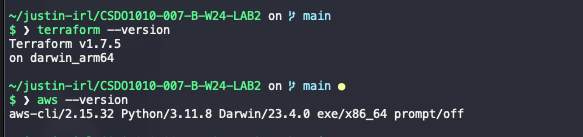
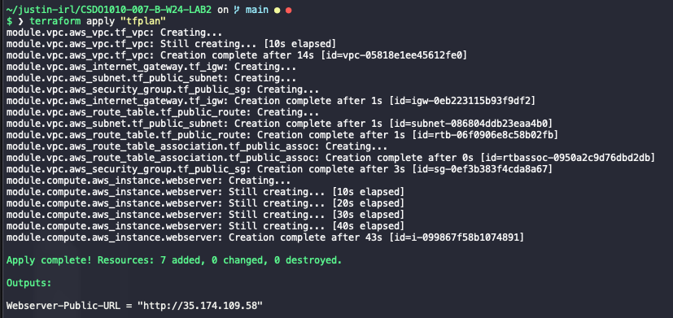

# CSDO1010-007-B-W24-LAB2 Report

## Task

- Manage AWS Infrastructure with Terraform

### Requirements

- `terraform` and `aws cli` command line outputs for version commands  
- `webserver-Public-URL` and the `url` assigned from the end of the Terraform apply output.
  - Please do not include all of the output from apply, just the `webserver-Public-URL` value
- The Cloud Computing Course webpage in your browser, including the address bar showing the `url`
- Provisioned Infrastructure as viewed through your AWS account, including the public IP of your webserver, under Instances.

## Report

- `terraform` and `aws cli` command line outputs for version commands  


- `webserver-Public-URL` and the `url` assigned from the end of the Terraform apply output.


## Note

- I already have an AWS free account from a previous project.
  - Account updated according to doc and `Admin` account created with required scopes.
- VsCode already pre installed and configured with the required extensions from previous work.

## Terraform issue with Mac `M(2)` chip

- `hashicorp` tapped and `terraform` installed at version `1.7.5`
  - most recent version for arm64/m chips as of this writing

Encountered some issues at this stage with the `terraform init` command:

```sh
~/justin-irl/CSDO1010-007-B-W24-LAB2 on  main ●
$ ❯ terraform init

Initializing the backend...
Initializing modules...

Initializing provider plugins...
- Finding latest version of hashicorp/template...
- Finding hashicorp/aws versions matching "~> 3.44.0"...
- Installing hashicorp/aws v3.44.0...
- Installed hashicorp/aws v3.44.0 (signed by HashiCorp)
╷
│ Error: Incompatible provider version
│
│ Provider registry.terraform.io/hashicorp/template v2.2.0 does not have a package available for your current platform, darwin_arm64.
│
│ Provider releases are separate from Terraform CLI releases, so not all providers are available for all platforms. Other versions of this provider may have different
│ platforms supported.
╵
```

### Solution

```sh
#control versioning by project:
brew install tfenv

tfenv init

tfenv install 1.7.5 && tfenv use 1.7.5

# add `terraform-version`
tfenv pin

# provider helper
brew install kreuzwerker/taps/m1-terraform-provider-helper

m1-terraform-provider-helper activate

m1-terraform-provider-helper install hashicorp/template -v v2.2.0
```

reload shell

```sh
exec $SHELL
```

update `./main/tf` to include:

```tf
terraform {
  required_providers {
    aws = {
      source = "hashicorp/aws"
      version = "5.43.0"
    }
  }
}
```

then run the following according to the provided doc (with the addition to `terraform apply`):

```sh
terraform init && terraform validate && terraform fmt && terraform plan -out=tfplan

terraform apply "tfplan"
### note
# it takes about 30-60 seconds from the time the apply command is run to the time the resources are created and available at the provided endpoint
```
